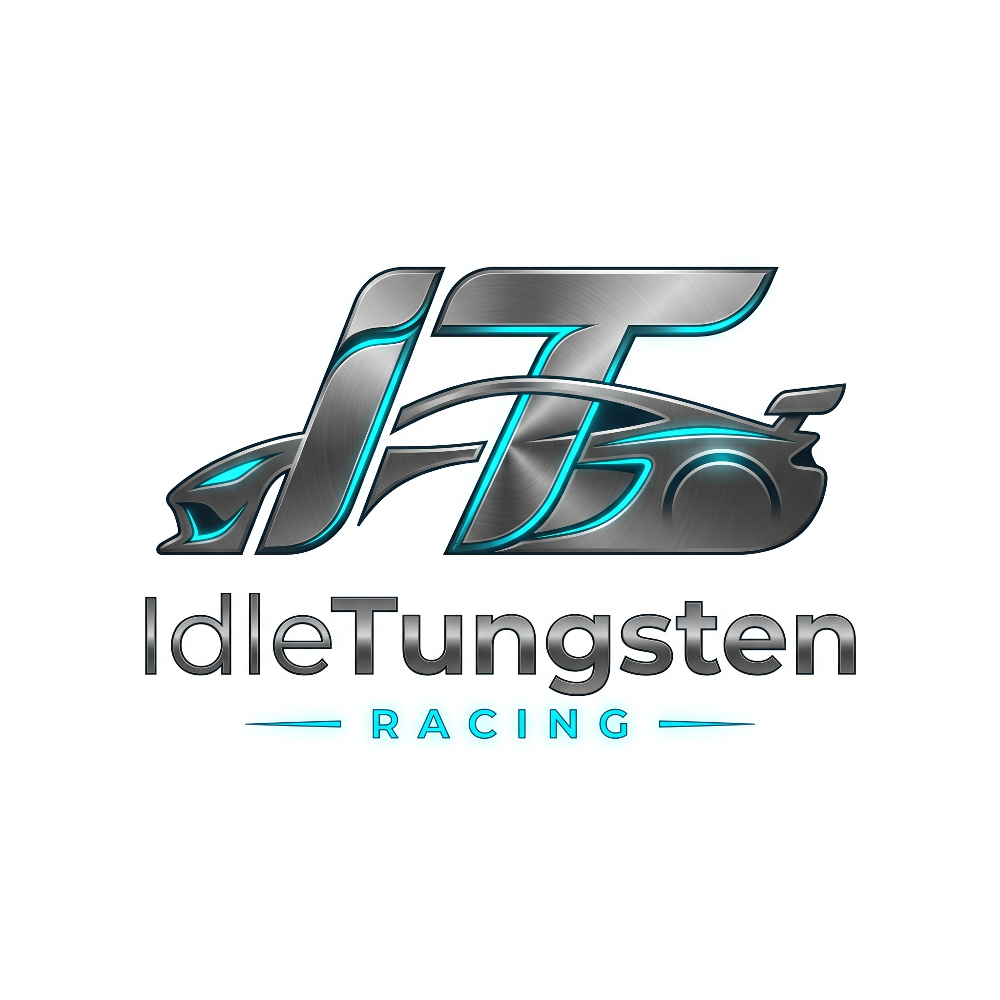

  

  <h1 align="center">DEMG-DEV</h1>
  
<b>Senior Full-Stack Engineer (.NET & C# Specialist) | SimRacing Telemetry Architect | Tech Creator</b>

  

    Desarrollo aplicaciones de alto rendimiento, sistemas de telemetría en tiempo real e infraestructuras web modernas. Apasionado por la arquitectura limpia, la ingeniería de software y la enseñanza tecnológica.
  

  

    <a href="https://www.courtbetsd.com/"><b>🌐 CourtBet Software Development</b></a> &nbsp;•&nbsp;
    <a href="https://controls.lagunanice.com/"><b>⚙️ Laguna Nice Controls</b></a>
  

  

    
    
    
    
  

---

## 🏎️ Proyectos Insignia (Featured Projects)

<table width="100%">
  <tr>
    <td width="50%" valign="top">
      <h3 align="center">🏁 GT7 Telemetry Pro</h3>
      
<b>F1 & Le Mans Edition</b>

      

        
      

      
Plataforma profesional de análisis de telemetría a <b>60 FPS</b> para <b>Gran Turismo 7 (PS4/PS5)</b>. Inspirada en los sistemas de muro de boxes profesionales (MoTeC i2 / Atlas).

      <ul>
        <li>⚡ <b>Zero-Stutter Dashboard</b>: Instrumentación circular renderizada en <code>QPainter</code> nativo.</li>
        <li>📊 <b>4 Gráficas Apiladas MoTeC</b>: Velocidad, RPM, pedales y Delta-T sincronizados por distancia.</li>
        <li>🧠 <b>Topografía Automática</b>: Detección heurística en más de 122 circuitos oficiales.</li>
        <li>🗄️ <b>Motor SQLite WAL</b>: Historial masivo e ilimitado de sesiones y vueltas.</li>
      </ul>
      

        <a href="https://github.com/DEMG-DEV/RGDev.App.GT7TelemetryPro"><b>👉 Explorar GT7 Telemetry Pro »</b></a>
      

    </td>
    <td width="50%" valign="top">
      <h3 align="center">📊 AC Results Analyzer</h3>
      
<b>Assetto Corsa Telemetry SPA</b>

      

        
      

      
Aplicación web SPA avanzada para analizar sesiones de carrera de <b>Assetto Corsa</b> con visualizaciones premium al estilo de las transmisiones de Fórmula 1.

      <ul>
        <li>🌐 <b>Persistencia Cloud</b>: Sincronización global con Vercel Blob y fallback a <code>localStorage</code>.</li>
        <li>📈 <b>7 Gráficas Motorsport</b>: Curvas de rendimiento, consistente degradación y telemetría por sector.</li>
        <li>🎨 <b>Temas de Marca</b>: Presets de escuderías (Ferrari 🔴, Porsche 🟤, Toyota 🔵, Ford 🔵🟠).</li>
        <li>🔍 <b>Buscador Inteligente</b>: Resolución automática de previews vía Wikipedia API.</li>
      </ul>
      

        <a href="https://github.com/DEMG-DEV/RGDev.App.AssettoCorsaResultsAnalizer"><b>👉 Explorar AC Results Analyzer »</b></a>
      

    </td>
  </tr>
</table>

---

## 🛠️ Stack Tecnológico & Especialidades

  <h3>Core Languages & Engineering</h3>
  

    
  

  <h3>Frameworks, UI & Telemetry Systems</h3>
  

    
  

  <h3>Databases, Cloud & DevOps</h3>
  

    
  

---

## 📊 Estadísticas & Actividad en GitHub

  
  

---

## 📚 Publicaciones & Divulgación Técnica

Escribo artículos, guías y tutoriales compartiendo buenas prácticas sobre desarrollo de software, arquitectura .NET y análisis de datos:

- ✍️ **[Dev.to (@demg_dev)](https://dev.to/demg_dev)** — Guías prácticas, tutoriales de arquitectura y desarrollo web.
- 🚀 **[Hashnode (Retrogemu Dev)](https://retrogemu-dev.hashnode.dev/)** — Artículos sobre ingeniería profunda, buenas prácticas y proyectos personales.

---

## 📫 Contacto & Redes Sociales

  

    
    
    
    
    
    
  

